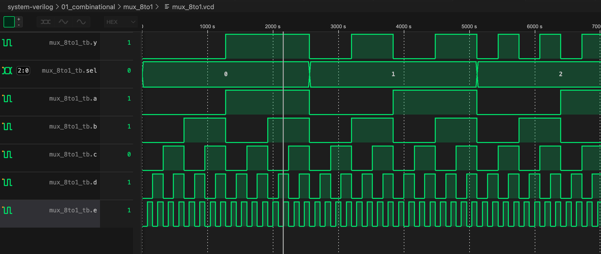
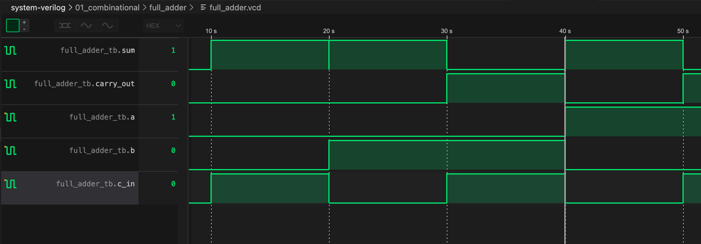

# SystemVerilog Proficiency Exercises

> **Goal: Complete proficiency in SystemVerilog design and verification**
> **Tools: Icarus Verilog, GTKWave**

[](.) [](.) [](LICENSE) [](https://wakatime.com/badge/user/6be6d0ea-ba20-4879-b9f3-13019a7f926a/project/bd508484-acac-461f-82bb-acd2ef4086ce)

> [!NOTE]
> This repository is a self-guided project serving as a personal guide to master SystemVerilog. It contains implementations and testbenches for various digital logic circuits to demonstrate and ensure proficiency in SystemVerilog design and verification.

---

## Navigation

| **Overview** | **Circuits** | **Verification** | **Usage** |
| :--- | :--- | :--- | :--- |
| [Mission](#mission-statement) | [Multiplexers](#implemented-circuits) | [Strategy](#verification-strategy) | [Commands](#how-to-run) |
| [Structure](#repository-structure) | [Arithmetic](#implemented-circuits) | [Waveforms](#waveforms) | [Examples](#example-commands) |

---

## Mission Statement

The objective of this repository is to systematically implement valid digital logic circuits, assertions, and testbenches. This serves as a practical codebase for mastering SystemVerilog syntax, hardware modeling from first principles, and simulation workflows.

---

## Implemented Circuits

The following components have been implemented, tested, and verified.

### Multiplexers

| Component | Description | Files |
| :--- | :--- | :--- |
| **2-to-1 Mux** | Basic selection logic between two inputs. | `mux2to1.sv`, `mux2to1_tb.sv` |
| **4-to-1 Mux** | Selection between four inputs using 2 select bits. | `mux4to1.sv`, `mux4to1_tb.sv` |
| **8-to-1 Mux** | Selection between eight inputs using 3 select bits. | `mux8to1.sv`, `mux8to1_tb.sv` |

### Arithmetic Units

| Component | Description | Files |
| :--- | :--- | :--- |
| **Full Adder** | 1-bit adder with Carry-In and Carry-Out support. | `full_adder.sv`, `full_adder_tb.sv` |

---

## Verification Strategy

Every circuit in this repository follows a strict verification lifecycle:

1.  **Design:** Implementation in SystemVerilog (`.sv`).
2.  **Testbench:** Development of a testbench (`_tb.sv`) to apply stimulus vectors.
3.  **Simulation:** Execution using `iverilog` to generate simulation logs.
4.  **Waveform Analysis:** Inspection of signals to ensure timing and logic correctness.

### Waveforms
Screenshots of all successful simulation waveforms are archived in the `media` directory. This directory strictly follows the structure of the source files, ensuring validation evidence is easy to locate.

---

## Repository Structure

```text
.
├── README.md           # Project documentation
├── full_adder.sv       # Full Adder Implementation
├── full_adder_tb.sv    # Full Adder Testbench
├── mux2to1.sv          # 2-to-1 Mux Implementation
├── mux2to1_tb.sv       # 2-to-1 Mux Testbench
├── mux4to1.sv          # 4-to-1 Mux Implementation
├── mux4to1_tb.sv       # 4-to-1 Mux Testbench
├── mux8to1.sv          # 8-to-1 Mux Implementation
├── mux8to1_tb.sv       # 8-to-1 Mux Testbench
└── media/              # Verification Artifacts
    ├── full_adder/     # Waveforms for adder
    └── mux/            # Waveforms for multiplexers
```

---

## How to Run

To run the simulations locally, ensure you have **Icarus Verilog** installed.

### Standard Execution Command

The project uses `iverilog` with the `-g2012` flag to enable SystemVerilog standard support.

**Syntax:**
```bash
iverilog -g2012 -o [output_file] [source_file] [testbench_file] && ./[output_file]
```

### Example Commands

**1. Verify Full Adder:**
```bash
iverilog -g2012 -o sim.out full_adder.sv full_adder_tb.sv && ./sim.out
```

**2. Verify 2-to-1 Multiplexer:**
```bash
iverilog -g2012 -o sim.out mux2to1.sv mux2to1_tb.sv && ./sim.out
```

**3. Verify 4-to-1 Multiplexer:**
```bash
iverilog -g2012 -o sim.out mux4to1.sv mux4to1_tb.sv && ./sim.out
```

**4. Verify 8-to-1 Multiplexer:**
```bash
iverilog -g2012 -o sim.out mux8to1.sv mux8to1_tb.sv && ./sim.out
```

---

## Designs

### 8-to-1 Multiplexer


### Full Adder


## Author
Tyrone Marhguy
[tmarhguy.com](https://tmarhguy.com)
